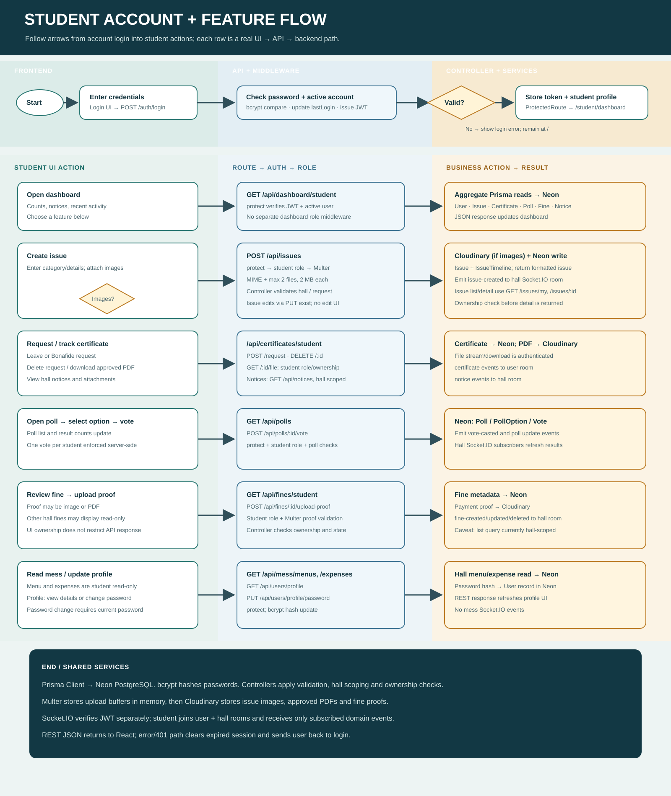
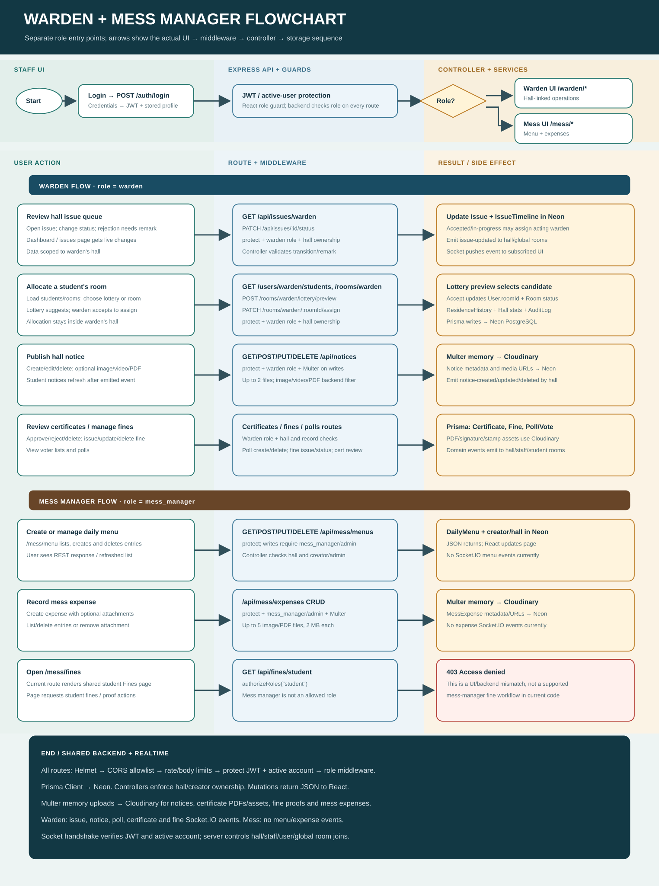
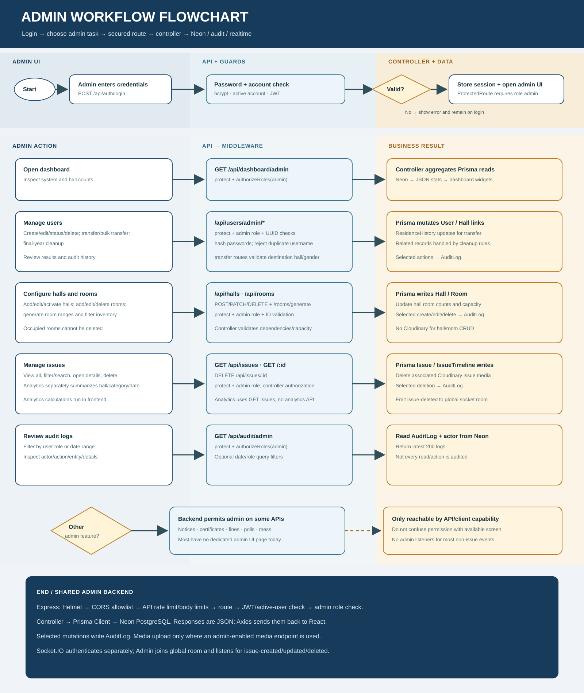

# HallDesk

HallDesk is a web application for managing hostel operations. It brings students, wardens, mess managers, and administrators into one role-based system for issue tracking, hall and room management, notices, certificates, fines, polls, and mess records.

## Workflows

### Student

### Staff

### Administrator

## Technology

- Frontend: React, Vite, React Router, Bootstrap
- Backend: Node.js, Express, Socket.IO
- Database: PostgreSQL through Prisma
- Uploads: Cloudinary
- Authentication: JWT with role-based authorization

## Local setup

Requirements: Node.js, npm, and a PostgreSQL database. Cloudinary credentials are needed for file uploads.

1. Install dependencies in `backend` and `frontend` with `npm install`.
2. Copy `backend/.env.example` to `backend/.env` and fill in the database, JWT, CORS, and Cloudinary settings. Set `DIRECT_URL` to the direct PostgreSQL connection string and `DATABASE_URL` to the application connection string.
3. Copy `frontend/.env.example` to `frontend/.env` and set the API and Socket.IO URLs if they differ from the local defaults.
4. In `backend`, run `npx prisma generate` and `npx prisma db push` to prepare a development database.
5. Start the API with `npm run dev` in `backend`, then start the web app with `npm run dev` in `frontend`.

The frontend is served by Vite, normally at `http://localhost:5173`; the API defaults to `http://localhost:5000`.

## Checks

- Backend tests: `npm test` from `backend`
- Frontend lint: `npm run lint` from `frontend`
- Frontend production build: `npm run build` from `frontend`

## Demo data

Optional seed scripts are in `backend/seed`. The admin and warden seeds require `ADMIN_SEED_PASSWORD` and `WARDEN_SEED_PASSWORD`, respectively, to be set in the environment before running `npm run seed:admin` or `npm run seed:wardens`. Use disposable credentials and a non-production database for demo data.